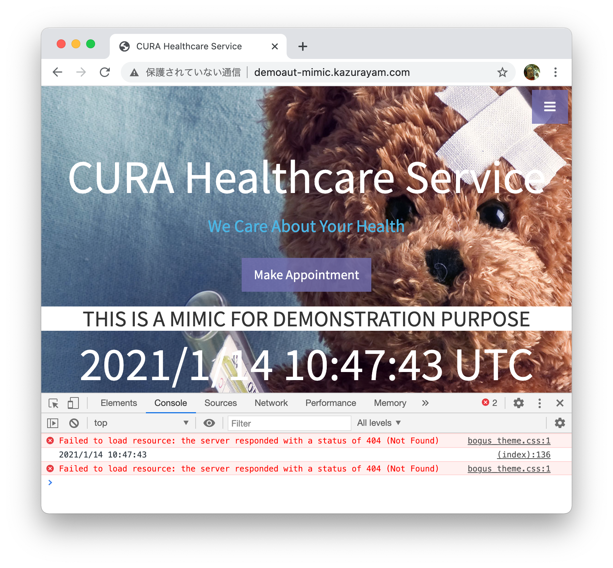

How to find broken references from a web page to stylesheets/javascripts/images
====

## Problem to solve

When I open https://katalon-demo-cura.herokuapp.com/ in Chrome browser, in the Chrome DevTools' Console tab, I saw an error message:



Here you can see an error message:

`Failed to load resource: the server responded with a status of 404 (Not Found) bugus_theme.css`

This message tells me that the web page has broken references to stylesheets/javascripts/images. Developers and testers would be interested this type of error messages.

Chrome DevTools provides wonderful Console tab where you are alarmed tones of alarms:

- https://developers.google.com/web/tools/chrome-devtools/console/log

But I have to operate the tool manually, which could be cumbersome. Say, I have 300 URLs to check if they have any broken references. Then I want to automate checking all of them. I want my Katalon Test Case to get access to the "404 Not Found" error messages which is visible in the DevTools Console tab.

Is it possible?

## Solution

Chrome DevTools Protocol (a.k.a. CDP) supports []() and []() interface. The Chrome browser supports CDP fully. If we can utilize CDP in Katalon Studio Test Case, it would be possible to transfer the `console.log()` messages from Chrome browser to the test script. 


## Description

### Code

The sample code is
[Test Cases/Log Requests and Responses](../Scripts/Log%20Requests%20and%20Responses/Script1610620664750.groovy)

Here I copy&paste the fragment here for easier reference:

```
WebUI.openBrowser('')
WebUI.setViewPortSize(1024,768)

/** Get DevTools service to a tab in Chrome browser */
ChromeDevToolsService devToolsService = CdpUtils.getService()

/** Get indivisual CDP commands */
Page page = devToolsService.getPage()
Network network = devToolsService.getNetwork()

page.enable()
network.enable()

/** Log requests */
network.onRequestWillBeSent({ RequestWillBeSent event ->
	println "request : ${event.getRequest().getMethod()} ${event.getRequest().getUrl()}"
})

/** Log responses */
network.onResponseReceived({ ResponseReceived event ->
	Response resp = event.getResponse()
	println "response: ${resp.getStatus()} ${resp.getStatusText()} ${resp.getUrl()}"
})

/** Wait for on load event */
page.onLoadEventFired({ LoadEventFired devent ->
	// Evaluate javascript
	devToolsService.close()
})

/** Navigate to the Application Under Test */
WebUI.navigateToUrl('http://demoaut-mimic.kazurayam.com/')
devToolsService.waitUntilClosed()
// finito
WebUI.delay(3)
WebUI.closeBrowser()
```

### Output

When I executed the "Log Requests and Responses" test case, I got the following output:

```
request : GET http://demoaut-mimic.kazurayam.com/
response: 200 OK http://demoaut-mimic.kazurayam.com/
request : GET https://cdnjs.cloudflare.com/ajax/libs/twitter-bootstrap/3.3.7/css/bootstrap.min.css
request : GET https://cdnjs.cloudflare.com/ajax/libs/bootstrap-datepicker/1.6.4/css/bootstrap-datepicker.min.css
request : GET http://demoaut.katalon.com//css/theme.css
request : GET http://demoaut.katalon.com//css/bogus_theme.css
request : GET https://cdnjs.cloudflare.com/ajax/libs/font-awesome/4.7.0/css/font-awesome.min.css
request : GET https://fonts.googleapis.com/css?family=Source+Sans+Pro:300,400,700,300italic,400italic,700italic
request : GET https://cdnjs.cloudflare.com/ajax/libs/jquery/1.11.3/jquery.min.js
request : GET https://cdnjs.cloudflare.com/ajax/libs/twitter-bootstrap/3.3.7/js/bootstrap.min.js
request : GET https://cdnjs.cloudflare.com/ajax/libs/bootstrap-datepicker/1.6.4/js/bootstrap-datepicker.min.js
request : GET http://demoaut.katalon.com//js/theme.js
request : GET chrome-extension://hdholmmobnfnkjgnbmgakgjlbkpjdgkj/content/wait.js
response: 200 OK chrome-extension://hdholmmobnfnkjgnbmgakgjlbkpjdgkj/content/wait.js
response: 200  https://cdnjs.cloudflare.com/ajax/libs/twitter-bootstrap/3.3.7/css/bootstrap.min.css
response: 200  https://cdnjs.cloudflare.com/ajax/libs/bootstrap-datepicker/1.6.4/css/bootstrap-datepicker.min.css
response: 200  https://cdnjs.cloudflare.com/ajax/libs/font-awesome/4.7.0/css/font-awesome.min.css
response: 200  https://cdnjs.cloudflare.com/ajax/libs/twitter-bootstrap/3.3.7/js/bootstrap.min.js
response: 200  https://cdnjs.cloudflare.com/ajax/libs/bootstrap-datepicker/1.6.4/js/bootstrap-datepicker.min.js
response: 200  https://cdnjs.cloudflare.com/ajax/libs/jquery/1.11.3/jquery.min.js
response: 200  https://fonts.googleapis.com/css?family=Source+Sans+Pro:300,400,700,300italic,400italic,700italic
request : GET https://katalon-demo-cura.herokuapp.com//css/theme.css
request : GET https://katalon-demo-cura.herokuapp.com//css/bogus_theme.css
request : GET https://katalon-demo-cura.herokuapp.com//js/theme.js
response: 200 OK https://katalon-demo-cura.herokuapp.com//css/theme.css
response: 404 Not Found https://katalon-demo-cura.herokuapp.com//css/bogus_theme.css
request : GET https://katalon-demo-cura.herokuapp.com//img/header.jpg
request : GET https://cdnjs.cloudflare.com/ajax/libs/font-awesome/4.7.0/fonts/fontawesome-webfont.woff2?v=4.7.0
request : GET https://fonts.gstatic.com/s/sourcesanspro/v14/6xK3dSBYKcSV-LCoeQqfX1RYOo3qOK7lujVj9w.woff2
request : GET https://fonts.gstatic.com/s/sourcesanspro/v14/6xKydSBYKcSV-LCoeQqfX1RYOo3ig4vwlxdu3cOWxw.woff2
response: 200 OK https://katalon-demo-cura.herokuapp.com//js/theme.js
response: 200  https://fonts.gstatic.com/s/sourcesanspro/v14/6xKydSBYKcSV-LCoeQqfX1RYOo3ig4vwlxdu3cOWxw.woff2
response: 200  https://fonts.gstatic.com/s/sourcesanspro/v14/6xK3dSBYKcSV-LCoeQqfX1RYOo3qOK7lujVj9w.woff2
response: 200  https://cdnjs.cloudflare.com/ajax/libs/font-awesome/4.7.0/fonts/fontawesome-webfont.woff2?v=4.7.0
response: 200 OK https://katalon-demo-cura.herokuapp.com//img/header.jpg
```

Please remark a line of "404 Not Found" here. This sample code just print the line. Of course you can do anything as you like.


### Prerequisites

You need to install the "Chrome DevTools Protocol Integration" plugin into your local Katalon Studio.
It is avaliable fre at
https://store.katalon.com/product/144/Chrome-DevTools-Protocol-Integration

I tested this project using Katalon Studio version 7.6.6.
